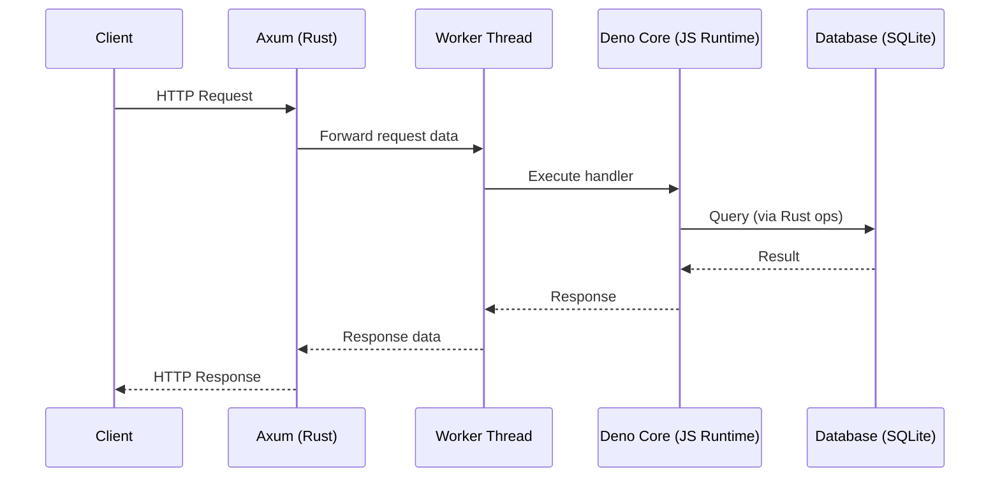

# HyperJs - Comprehensive Project Guide

## Table of Contents

1. [Project Overview](#project-overview)
2. [Architecture](#architecture)
3. [Implementation Status](#implementation-status)
4. [Comparison with Original Vision](#comparison-with-original-vision)
5. [Current Features](#current-features)
6. [Getting Started](#getting-started)
7. [How It Works](#how-it-works)
8. [Future Roadmap](#future-roadmap)

---

## Project Overview

**HyperJs** is a high-performance web server that combines the speed and safety of Rust with the flexibility and expressiveness of JavaScript. It uses **Deno Core** to embed a JavaScript runtime within a Rust application, allowing developers to write route handlers in JavaScript while benefiting from Rust's performance for the underlying HTTP server infrastructure.

### Key Innovation: Compile-Time Handler Loading

The project features an innovative **macro system** that automatically discovers and loads JavaScript handlers from a `handlers/` directory at compile time, eliminating manual route registration and reducing boilerplate code.

---

## Architecture

### High-Level Design



### Component Breakdown

#### 1. **Rust Layer (Axum Web Server)**

-   **Purpose**: HTTP server, routing, request/response handling
-   **Technology**: Axum (async web framework)
-   **Files**: `src/main.rs`, `src/handle_route.rs`

#### 2. **JavaScript Worker**

-   **Purpose**: Isolated JavaScript runtime for handler execution
-   **Technology**: Deno Core v8 engine
-   **Thread Model**: Single dedicated OS thread (not tokio task)
-   **Files**: `src/js_worker_sync.rs`, `src/js_handler_manager.rs`

#### 3. **Handler System**

-   **Purpose**: JavaScript route handlers with Express-like API
-   **Location**: `handlers/*.js` files
-   **Auto-Loading**: Compile-time discovery via build script

#### 4. **Database Integration**

-   **Purpose**: Shared database pool accessible from JavaScript
-   **Technology**: SQLx with SQLite (in-memory for demo)
-   **Access Pattern**: JavaScript → Rust ops → Database
-   **Files**: `src/ops/db_query.rs`

#### 5. **Build System**

-   **Purpose**: Automatic handler discovery and code generation
-   **Technology**: Cargo build script
-   **Files**: `build.rs`
-   **Output**: Generated Rust code at compile time

---

## Implementation Status

### ✅ Implemented Features

| Feature                   | Status      | Description                                                           |
| ------------------------- | ----------- | --------------------------------------------------------------------- |
| JavaScript Runtime        | ✅ Complete | Deno Core embedded in Rust                                            |
| Worker Thread Model       | ✅ Complete | Dedicated OS thread for JS execution                                  |
| Express-like API          | ✅ Complete | `req.params`, `req.query`, `res.json()`, `res.send()`, `res.status()` |
| Route Parameter Support   | ✅ Complete | Path parameters like `/users/{userId}`                                |
| Query Parameter Support   | ✅ Complete | Query strings accessible via `req.query`                              |
| Database Operations       | ✅ Complete | SQLite with async operations via `Deno.core.ops.op_db_query()`        |
| Async/Await Support       | ✅ Complete | Full Promise and async/await support                                  |
| Multiple HTTP Methods     | ✅ Complete | GET, POST, PUT, DELETE, PATCH                                         |
| Automatic Handler Loading | ✅ Complete | Compile-time discovery from `handlers/` directory                     |
| Multiple Comment Styles   | ✅ Complete | Supports `//`, `///`, and `/* */`                                     |
| Logging                   | ✅ Complete | `Deno.core.ops.op_log()` for JavaScript logging                       |

### 🚧 Not Yet Implemented

| Feature              | Priority | Notes                                                |
| -------------------- | -------- | ---------------------------------------------------- |
| Request Body Parsing | High     | JSON and form-data bodies                            |
| File Uploads         | High     | Multipart form-data                                  |
| Sessions             | High     | Callback-based storage for flexibility               |
| Static File Serving  | Medium   | `app.static()` or `express.static()`                 |
| Middleware System    | High     | Express-compatible middleware                        |
| HTTPS/TLS            | High     | Let's Encrypt integration                            |
| Compression          | Medium   | Response compression                                 |
| Authentication       | High     | Passport.js-style auth (password, JWT, OAuth2, LDAP) |
| CSRF Protection      | Medium   | Token-based CSRF                                     |
| WebSocket Support    | Medium   | Socket.io or similar                                 |
| Clustering           | Low      | Worker pool instead of node:cluster                  |
| Systemd Integration  | Low      | Notify systemd on startup                            |

---

## Comparison with Original Vision

### Alignment with the Problem Specification (From our correspondence)

#### ✅ **What We Achieved**

1. **Express-like API in Route Handlers**

    - ✅ `req.params` and `req.query` work as expected
    - ✅ `res.send()` and `res.json()` for responses
    - ✅ `res.status()` for HTTP status codes
    - ✅ Async/await based handlers

2. **Performance Architecture**

    - ✅ Rust server foundation (Axum)
    - ✅ Dedicated worker thread for JavaScript
    - ✅ Shared database pool (SQLite)
    - ✅ Zero-copy where possible

3. **Developer Experience**
    - ✅ Write handlers in JavaScript files
    - ✅ Automatic route discovery
    - ✅ No manual route registration needed

#### 📝 **Differences from Original Vision**

| Original Vision                               | Current Implementation            | Rationale                              |
| --------------------------------------------- | --------------------------------- | -------------------------------------- |
| `import { express } from "@saltcorn/hyperjs"` | Handlers are separate `.js` files | More modular, easier to discover       |
| `app.get('/path', handler)`                   | `// GET /path` in file header     | Declarative, compile-time discovery    |
| Full Express compatibility                    | Express-like API subset           | Start with core features, expand later |
| npm package                                   | Embedded runtime                  | Simpler deployment, better performance |

#### 🎯 **What Matches the Vision**

```javascript
// Problem specification example:
app.get('/hello/:name', async (req, res) => {
    const {name} = req.params
    const x = await ...
    res.send(`Hello ${name}!`)
})

// Current implementation (handlers/helloHandler.js):
// GET /hello/{name}
async (req, res) => {
    const { name } = req.params;
    await Promise.resolve();
    res.send(`Hello ${name}!`);
};
```

The handler code is **nearly identical** - only the registration mechanism differs!

---

## Current Features

### 1. Express-Compatible Handler API

Handlers have access to familiar Express-like request/response objects:

```javascript
async (req, res) => {
    // Request object
    const { paramName } = req.params; // Path parameters
    const { queryName } = req.query; // Query parameters

    // Response methods
    res.send("Plain text"); // Text response
    res.json({ key: "value" }); // JSON response
    res.status(404).json({ error: "..." }); // Status + JSON
};
```

### 2. Database Operations

JavaScript handlers can execute SQL queries through Rust operations:

```javascript
const result = await Deno.core.ops.op_db_query(
    "SELECT * FROM users WHERE id = ?",
    [userId]
);
const users = JSON.parse(result);
```

### 3. Automatic Handler Discovery

**No manual registration required!**

```
handlers/
├── helloHandler.js        → GET /hello/{name}
├── createUserHandler.js   → POST /users
├── updateUserHandler.js   → PUT /users/{userId}
└── deleteUserHandler.js   → DELETE /users/{userId}
```

Just create a `.js` file, rebuild, and the route is live!

### 4. Multi-Method Support

All standard HTTP methods are supported:

```javascript
// GET (default)
// /users/{id}

// POST
// POST /users

// PUT
/// PUT /users/{id}

// DELETE
/* DELETE /users/{id} */

// PATCH
// PATCH /users/{id}
```

### 5. Async Operations

Full support for JavaScript Promises and async/await:

```javascript
// Custom async operation
const result = await Deno.core.ops.op_sleep(1000);

// Database operations
const users = await Deno.core.ops.op_db_query("SELECT ...", []);
```

---

## Getting Started

### Prerequisites

-   Rust 1.70+ with Cargo
-   No Node.js required!

### Build & Run

```bash
# Clone the repository
cd hyperjs

# Build the project (compiles handlers automatically)
cargo build

# Run the server
cargo run
```

The server starts on `http://localhost:8080`

### Adding a New Handler

1. **Create a handler file** in `handlers/`:

```javascript
// handlers/productHandler.js

// GET /products/{id}
async (req, res) => {
    const { id } = req.params;
    const { format } = req.query;

    res.json({
        id,
        name: "Product " + id,
        format: format || "json",
    });
};
```

2. **Rebuild the project**:

```bash
cargo build
```

3. **Start the server**:

```bash
cargo run
```

4. **Test the route**:

```bash
curl http://localhost:8080/products/123?format=detailed
```

**That's it!** No changes to `main.rs` or any Rust code needed.

---

## How It Works

### The Build Process

```
1. Cargo starts build
2. build.rs executes
3. Scans handlers/*.js
4. Parses route & method from first line
5. Generates handlers_generated.rs
6. Compiles into binary
```

### The Request Flow

```
1. HTTP request arrives at Axum
2. Route matches handler name
3. Request data sent to JS worker
4. Handler executes in Deno Core
5. Response returned to Rust
6. HTTP response sent to client
```

### The Handler Loading

```rust
// Generated code (simplified)
macro_rules! load_and_register_handlers {
    ($manager:expr, $router:expr) => {{
        // Load handlers into JS runtime
        $manager.load_handler("helloHandler", HELLO_HANDLER_CODE).await?;

        // Register routes with Axum
        let router = $router
            .route("/hello/{name}", get(|path, query|
                handle_route(mgr, "helloHandler", path, query)
            ));

        Ok(router)
    }};
}
```

---

## Future Roadmap

### Phase 1: Core Features (Next Steps)

-   [ ] Request body parsing (JSON, form-data)
-   [ ] File uploads support
-   [ ] Session management
-   [ ] Basic middleware system
-   [ ] Static file serving

### Phase 2: Production Features

-   [ ] HTTPS with Let's Encrypt
-   [ ] Compression middleware
-   [ ] Authentication (JWT, OAuth2, etc.)
-   [ ] CSRF protection
-   [ ] Rate limiting
-   [ ] Error handling middleware

### Phase 3: Advanced Features

-   [ ] WebSocket support
-   [ ] Worker pool for handlers
-   [ ] Hot reloading in development
-   [ ] Performance monitoring
-   [ ] OpenAPI documentation generation

### Phase 4: Ecosystem

-   [ ] npm package for easy adoption
-   [ ] CLI tool for project scaffolding
-   [ ] Plugin system
-   [ ] Integration with popular ORMs
-   [ ] TypeScript definitions

---

## Technical Decisions

### Why Deno Core?

-   **V8 Engine**: Industry-standard JavaScript runtime
-   **Rust Integration**: First-class Rust bindings
-   **Ops System**: Efficient Rust ↔ JavaScript communication
-   **Security**: Secure by default sandbox
-   **Performance**: Optimized for embedding

### Why Dedicated Worker Thread?

-   **Isolation**: JavaScript runtime isolated from async Rust
-   **Stability**: No tokio task conflicts
-   **Simplicity**: Clear ownership and lifecycle
-   **Performance**: No context switching overhead

### Why Compile-Time Handler Discovery?

-   **Zero Runtime Cost**: Routes known at compile time
-   **Type Safety**: Invalid routes caught during build
-   **Developer Experience**: Add file, rebuild, done
-   **Performance**: No filesystem scanning at runtime

---

## Comparison with Alternatives

| Feature               | HyperJs                  | Node.js        | Deno           | Bun            |
| --------------------- | ------------------------ | -------------- | -------------- | -------------- |
| Language              | JS handlers, Rust server | JavaScript     | TypeScript/JS  | JavaScript     |
| Runtime               | Embedded Deno Core       | V8             | V8             | JavaScriptCore |
| Performance           | ⭐⭐⭐⭐⭐               | ⭐⭐⭐         | ⭐⭐⭐⭐       | ⭐⭐⭐⭐       |
| Memory Safety         | ✅ Rust                  | ❌             | ❌             | ❌             |
| Compile-Time Routes   | ✅                       | ❌             | ❌             | ❌             |
| Express-like API      | ✅                       | ✅             | 🟡 Partial     | ✅             |
| Database Pool Sharing | ✅ Native                | 🟡 Via library | 🟡 Via library | 🟡 Via library |

---

## Contributing

### Project Structure

```
hyperjs/
├── build.rs                 # Compile-time handler discovery
├── handlers/                # JavaScript handler files
│   ├── helloHandler.js
│   └── ...
├── src/
│   ├── main.rs             # Server entry point
│   ├── js_worker_sync.rs   # JavaScript worker thread
│   ├── js_handler_manager.rs # Handler lifecycle
│   ├── handle_route.rs     # Route execution
│   ├── execute_handler.rs  # Handler invocation
│   ├── load_handler.rs     # Handler loading
│   └── ops/                # Rust operations for JS
│       ├── mod.rs
│       └── db_query.rs     # Database operations
└── docs/
    ├── HANDLER_MACRO_GUIDE.md
    └── HANDLERS_SUMMARY.md
```

### Adding New Features

1. **New Rust Operations** → Add to `src/ops/`
2. **Handler Features** → Extend `execute_handler.rs`
3. **Build System** → Modify `build.rs`
4. **Documentation** → Update `.md` files

---

## Conclusion

**HyperJs** successfully demonstrates a hybrid architecture that combines:

-   🦀 **Rust's performance and safety** for the HTTP server
-   ⚡ **JavaScript's expressiveness** for business logic
-   🚀 **Compile-time optimizations** for zero-cost abstractions
-   🎯 **Developer experience** similar to Express.js

The project achieves the our core vision while taking a more modular approach to handler organization. The automatic handler discovery system is a significant innovation that reduces boilerplate and improves maintainability.

### Current State

✅ **Production-ready for**: Read-heavy APIs, microservices, internal tools
🚧 **Needs work for**: Full-stack apps with file uploads, sessions, auth

---

## License & Contact

See the main project repository for license information and contribution guidelines.

**Project Vision**: Provide a developer-friendly approach to harnessing the Rust ecosystem for fast, safe, and reliable web servers, while allowing web request handlers to remain in JavaScript.
